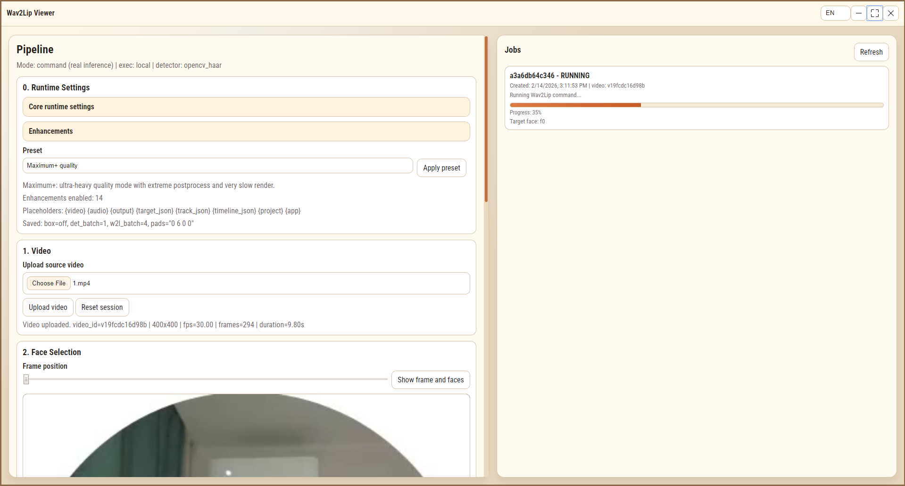
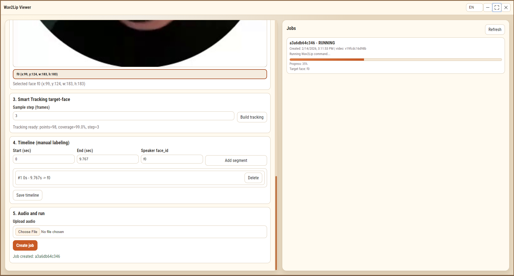

<div align="center">

# LipFlow

Portable desktop UI for Wav2Lip workflow (Windows).

<p>
  <a href="https://drive.google.com/drive/folders/REPLACE_WITH_YOUR_LINK">
    
  </a>
</p>

<p><strong>Note:</strong> This is a fully portable solution. For GPU mode, installed NVIDIA/CUDA drivers are required on the target system.</p>

<p>
  
  
  
</p>

</div>

## Screenshots

| Main UI | Jobs / Pipeline |
|---|---|
|  |  |

## What It Does

- Upload source video and audio.
- Probe frame and select target face.
- Build target-face tracking.
- Save timeline segments.
- Create and run jobs (local queue worker).
- Supports extended input containers.
- Auto-normalizes problematic video codecs with FFmpeg fallback.

## Quick Start

### 1. Run

- CPU: `only_cpu.bat`
- GPU: `only_gpu.bat`
- Debug CPU: `debug_cpu.bat`
- Debug GPU: `debug_gpu.bat`

### 2. Optional portable self-check

```bat
portable_check.bat
```

## Portable Distribution Model

This GitHub repository is **source-only**.
Heavy portable artifacts are intentionally excluded from git:

- `app/python` (embedded Python runtime)
- `app/bin/ffmpeg` (bundled FFmpeg/FFprobe)
- `Wav2Lip/checkpoints` (model weights)
- runtime outputs/caches (`app/data/*`, `app/logs`)

Distribute full portable build separately (Google Drive archive).

## Runtime / Inference Notes

- `stub` mode: output is a copy flow for pipeline testing.
- `command` mode: real inference command from UI (`Runtime Settings`) or `W2L_INFER_CMD`.
- Variables available in command template:
  - `{video}`, `{audio}`, `{output}`
  - `{target_json}`, `{track_json}`, `{timeline_json}`
  - `{project}`, `{app}`

Recommended command template:

```text
{app}\\python\\python.exe {app}\\workers\\wav2lip_runner.py --video "{video}" --audio "{audio}" --output "{output}" --target-json "{target_json}" --track-json "{track_json}" --timeline-json "{timeline_json}"
```

## API (Current)

- `POST /api/video/upload`
- `GET /api/video/meta?video_id=...`
- `POST /api/video/probe`
- `POST /api/face/select`
- `GET /api/face/selection?video_id=...`
- `POST /api/tracking/build`
- `GET /api/tracking?video_id=...`
- `POST /api/timeline/save`
- `GET /api/timeline?video_id=...`
- `POST /api/job/submit`
- `GET /api/jobs`
- `POST /api/output/open`
- `POST /api/job/requeue`
- `POST /api/job/cancel`
- `POST /api/job/delete`
- `GET /api/settings`
- `POST /api/settings`

## License

- LipFlow wrapper code (UI/backend/launcher/scripts in this repository, excluding third-party subtrees): see `LICENSE`.
- `Wav2Lip/` and related models/checkpoints are third-party and follow upstream terms (including non-commercial restrictions from Wav2Lip project/datasets).
- Bundled third-party binaries/libraries keep their original licenses.

## Disclaimer

Use responsibly and comply with all model/dataset/license and local-law requirements.
